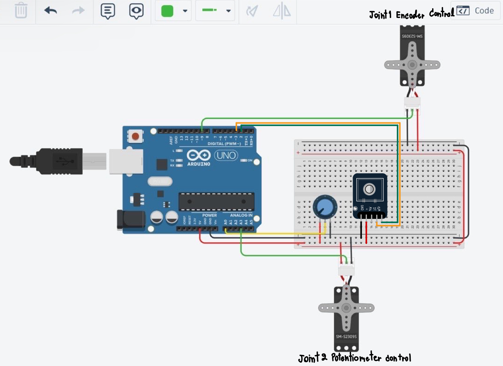

# Robot RP Miniproject
## Description
Create a robotic arm with RP joint1 rotating in a rotational motion and joint2 moving in a prismatic motion.
We will use Python3 to create a GUI for controlling the motion of an RP robotic arm and it can be manually controlled using an encoder for joint1 and a potentiometer for joint2. Additionally, you can visualize the motion of the RP robotic arm using RViz.
## Table of Content
- [Robot RP Miniproject](#robot-rp-miniproject)
  - [Description](#description)
  - [Table of Content](#table-of-content)
  - [Component](#component)
    - [Hardware](#hardware)
    - [Software](#software)
    - [Electrical Circuit](#electrical-circuit)
  - [Installation Library](#installation-library)
  - [Download Repository from Github](#download-repository-from-github)
  - [Executing program](#executing-program)
  - [Authors](#authors)

## Component
### Hardware
|NO  | List                          | Amount(Pcs) | 
|:---| :----------------------------:| -----------:| 
|1   | [Arduino UNO](https://www.farnell.com/datasheets/1682209.pdf)                   |     1       | 
|2   | [Servo mg90s](https://datasheetspdf.com/pdf-file/1106582/ETC/MG90S/1)                   |     2       | 
|3   | [Potentiometer B10k](https://www.mikroelec.com/product/1432/%E0%B8%95%E0%B8%B1%E0%B8%A7%E0%B8%95%E0%B9%89%E0%B8%B2%E0%B8%99%E0%B8%97%E0%B8%B2%E0%B8%99%E0%B8%9B%E0%B8%A3%E0%B8%B1%E0%B8%9A%E0%B8%84%E0%B9%88%E0%B8%B2%E0%B9%84%E0%B8%94%E0%B9%89-b10k-%E0%B9%81%E0%B8%81%E0%B8%99%E0%B8%A2%E0%B8%B2%E0%B8%A7-15mm-3%E0%B8%82%E0%B8%B2-wh148-single-3pin-handle-shaft-length-15mm-single-potentio)            |     1       | 
|4   | [Encoder HW-040](https://www.robotechbd.com/product/electronics-components/resistor/hw-040-rotary-encoder-module/)                |     1       | 
|5   | [Protoboard](https://www.thaieasyelec.com/product/17/400-point-white-breadboard-protoboard)                   |     1       | 
|6   | [Battery Panasonic AA 1.5 V](https://www.allonline.7eleven.co.th/p/Panasonic-%E0%B8%96%E0%B9%88%E0%B8%B2%E0%B8%99%E0%B8%AD%E0%B8%B5%E0%B9%82%E0%B8%A7%E0%B8%A5%E0%B8%95%E0%B9%89%E0%B8%B2-AA-%E0%B9%81%E0%B8%9E%E0%B9%87%E0%B8%81-4-%E0%B8%8A%E0%B8%B4%E0%B9%89%E0%B8%99-AAA-%E0%B9%81%E0%B8%9E%E0%B9%87%E0%B8%81-2-%E0%B8%8A%E0%B8%B4%E0%B9%89%E0%B8%99/562457/)    |     4       | 
|7   | [Battery Holder Box 4x AA](https://www.allnewstep.com/product/661/battery-holder-box-%E0%B8%A3%E0%B8%B2%E0%B8%87%E0%B8%96%E0%B9%88%E0%B8%B2%E0%B8%99-aa-4-%E0%B8%81%E0%B9%89%E0%B8%AD%E0%B8%99-%E0%B9%81%E0%B8%9A%E0%B8%9A%E0%B8%A1%E0%B8%B5%E0%B8%9D%E0%B8%B2%E0%B8%9B%E0%B8%B4%E0%B8%94%E0%B8%9E%E0%B8%A3%E0%B9%89%E0%B8%AD%E0%B8%A1%E0%B8%AA%E0%B8%A7%E0%B8%B4%E0%B8%95%E0%B8%8A%E0%B9%8C-battery-holder-box-4x-aa-with-power-switc)      |     1       | 
### Software
1. Ubuntu Version 20.04
2. Ros Noetic 
3. Python3
4. [Arduino Version 1.8.15](https://linuxopsys.com/topics/install-arduino-ide-on-ubuntu-20-04)
5. [Visual studio code](https://phoenixnap.com/kb/install-vscode-ubuntu)
### Electrical Circuit

* Connect Encoder into Arduino.
  * PINClk = 2
  * PINDT = 3
* Connect Potentiometer into Arduino using A0 pin on Arduino.
  * potentiometerPin = A0
* Connect Servo controlled with Encoder into Arduino.
  * servo_encoder = 9

* Connect Servo controlled with Potentiometer into Arduino.
  * servo_potentiometer = A3

## Installation Library
* Arduino Version 1.8.15
    * [Rosserial Arduino Library by Joshua Frank Version 0.7.9](https://microcontrollerslab.com/rosserial-setup-ros-subscriber-node-arduino/)
    * [Encoder by Paul Stoffregen Version 1.4.4](https://www.arduino.cc/reference/en/libraries/encoder/)
    * Servo by Arduino Version 1.2.1
* Python3 in Visual studio code
  * Open Visual Studio Code.
  * Go to the Extensions view by clicking on the square icon in the Sidebar or pressing Ctrl+Shift+X.
  * Search for "CustomTkinter Snippets".
  * Click on the Install button.
* Install the module with pip
    ```
    pip3 install customtkinter
    ```
## Download Repository from Github
If you have a project directory that is currently not under version control and you want to start controlling it with Git, you first need to go to that project’s directory.

* Run this Command in terminal.
```
cd catkin_ws/src
git clone  https://github.com/Awanta64/RP_MiniProject2.git
cd ~/catkin_ws/
catkin_make
```

## Executing program

Open new terminal window, use roslaunch run package.
``` 
roslaunch Project_ros rviz1.launch  
```
## Authors

* Supannee Saengwonrarach 6452500121 (Coding)
* Awanta Arwon 6452500236 (Coding)
* Thanita Kaeoking 6452500244 (Machine Design)
